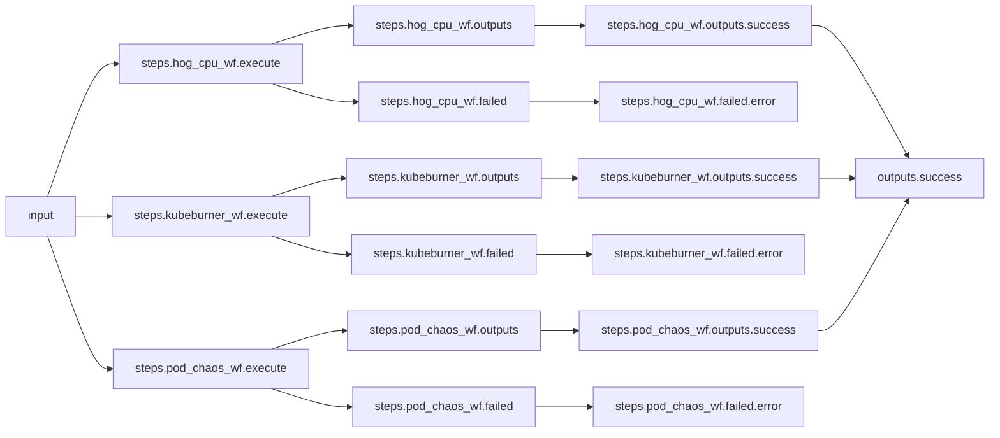
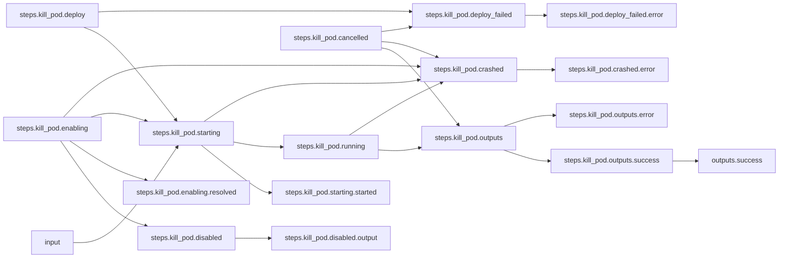
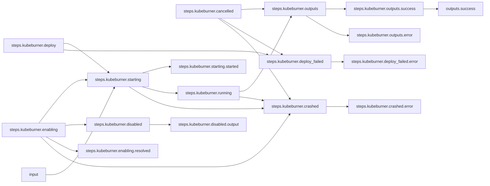

# OpenShift Shenanigans

***NOTE: This is an example only and may not work out-of-the-box.***

## Workflow Description

Given a target OpenShift cluster, this workflow executes a [kube-burner plugin](https://github.com/redhat-performance/arcaflow-plugin-kube-burner) workflow to place a load on the cluster, repeatedly removes a targeted pod at a given time frequency with the [kill-pod plugin](https://github.com/krkn-chaos/arcaflow-plugin-kill-pod), and runs a [stress-ng](https://github.com/ColinIanKing/stress-ng) CPU workload on the cluster.


## Files

- [`workflow.yaml`](workflow.yaml) -- Defines the workflow input schema, the plugins to run
  and their data relationships, and the output to present to the user
- [`input.yaml`](input-example.yaml) -- The input parameters that the user provides for running
  the workflow
- [`config.yaml`](config.yaml) -- Global config parameters that are passed to the Arcaflow
  engine
                     
## Running the Workflow

### Workflow Execution

Install Python, at least `3.9`.

First, add the path to your Python interpreter to `config.yaml` as the value 
for `pythonPath` as shown here. Second, add a directory to which your Arcaflow 
process will have write access as the value for `workdir`, `/tmp` is a 
common choice because your process will likely be able to write to it.

```yaml
deployers:
  python:
    pythonPath: ...
    workdir: /tmp
```

Download a Go binary of the latest version of the Arcaflow engine from: https://github.com/arcalot/arcaflow-engine/releases
 
Run the workflow:
```
$ export WFPATH=<path to this workflow directory>
$ arcaflow -input ${WFPATH}/input.yaml -config ${WFPATH}/config.yaml -context ${WFPATH}
```

## Workflow Diagram
This diagram shows the complete end-to-end workflow logic.

### Main Workflow



### Pod Chaos Workflow



### StressNG (CPU Hog) Workflow

```mermaid
%% Mermaid markdown workflow
flowchart LR
%% Success path
steps.kubeconfig.disabled-->steps.kubeconfig.disabled.output
steps.kubeconfig.starting-->steps.kubeconfig.starting.started
steps.kubeconfig.starting-->steps.kubeconfig.running
steps.kubeconfig.enabling-->steps.kubeconfig.enabling.resolved
steps.kubeconfig.enabling-->steps.kubeconfig.starting
steps.kubeconfig.enabling-->steps.kubeconfig.disabled
steps.stressng.outputs.success-->outputs.success
steps.stressng.disabled-->steps.stressng.disabled.output
steps.kubeconfig.deploy-->steps.kubeconfig.starting
steps.stressng.running-->steps.stressng.outputs
steps.stressng.starting-->steps.stressng.running
steps.stressng.starting-->steps.stressng.starting.started
steps.stressng.enabling-->steps.stressng.starting
steps.stressng.enabling-->steps.stressng.disabled
steps.stressng.enabling-->steps.stressng.enabling.resolved
steps.kubeconfig.outputs-->steps.kubeconfig.outputs.success
steps.kubeconfig.cancelled-->steps.kubeconfig.outputs
input-->steps.kubeconfig.starting
input-->steps.stressng.deploy
input-->steps.stressng.starting
steps.stressng.cancelled-->steps.stressng.outputs
steps.stressng.deploy-->steps.stressng.starting
steps.stressng.outputs-->steps.stressng.outputs.success
steps.kubeconfig.outputs.success-->steps.stressng.deploy
steps.kubeconfig.running-->steps.kubeconfig.outputs
%% Error path
steps.kubeconfig.starting-->steps.kubeconfig.crashed
steps.kubeconfig.enabling-->steps.kubeconfig.crashed
steps.stressng.deploy_failed-->steps.stressng.deploy_failed.error
steps.kubeconfig.deploy-->steps.kubeconfig.deploy_failed
steps.stressng.running-->steps.stressng.crashed
steps.stressng.starting-->steps.stressng.crashed
steps.kubeconfig.deploy_failed-->steps.kubeconfig.deploy_failed.error
steps.stressng.enabling-->steps.stressng.crashed
steps.kubeconfig.outputs-->steps.kubeconfig.outputs.error
steps.kubeconfig.cancelled-->steps.kubeconfig.crashed
steps.kubeconfig.cancelled-->steps.kubeconfig.deploy_failed
steps.stressng.cancelled-->steps.stressng.deploy_failed
steps.stressng.cancelled-->steps.stressng.crashed
steps.kubeconfig.crashed-->steps.kubeconfig.crashed.error
steps.stressng.deploy-->steps.stressng.deploy_failed
steps.stressng.outputs-->steps.stressng.outputs.error
steps.stressng.crashed-->steps.stressng.crashed.error
steps.kubeconfig.running-->steps.kubeconfig.crashed
%% Mermaid end
```



### Kube-Burner Workflow



