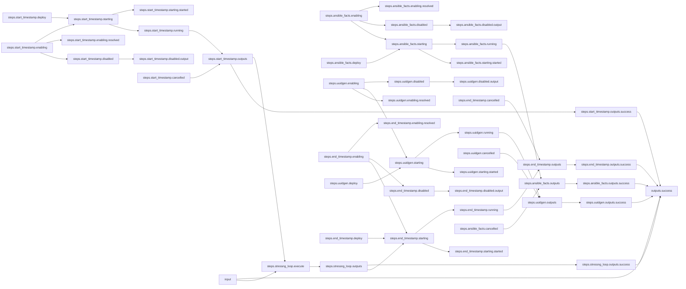

# Stress-NG + PCP Workflow

## Workflow Description

The primary [`workflow.yaml`](workflow.yaml) is designed to collect system metadata with
Ansible [gather facts](https://docs.ansible.com/ansible/latest/collections/ansible/builtin/gather_facts_module.html)
using the Arcaflow
[metadata plugin](https://github.com/arcalot/arcaflow-plugin-metadata), and then to run
loops of a stress-ng sub-workflow with various parameters.

In addition to the stress-ng workload, the sub-workflow collects system metrics with
[Performance Co-pilot](https://pcp.io/) using the Arcaflow
[pcp plugin](https://github.com/arcalot/arcaflow-plugin-pcp).

This is a complex workflow that exercises many Arcaflow features, including
[sub-workflows](/basic-examples/sub-workflow-foreach),
[serial wait-for](/basic-examples/serial-wait_for),
[namespaced scopes](/basic-examples/namespaced-scopes),
and [bind constants](/basic-examples/bind-constants).

## Files

- [`workflow.yaml`](workflow.yaml) -- Defines the outer workflow input schema, the
plugins and sub-workflow to run and their data relationships, and the output to present
to the user
- [`stressng-workflow.yaml`](stressng-workflow.yaml) -- Defines the inner workflow input
schema, plugins, and output for stress-ng tests. This workflow is looped over by the
`workflow.yaml`, but it can also be used stand-alone
- [`input.yaml`](sample-input.yaml) -- Example input parameters that the user provides
for running the outer workflow
- [`sample-input-stressng-cpu.yaml`](sample-input-stressng-cpu.yaml) -- Example CPU test
input parameters that can be used to run the `stressng-workflow.yaml` workflow as a
stand-alone workflow
- [`sample-input-stressng-memory.yaml`](sample-input-stressng-memory.yaml) -- Example
memory test input parameters that can be used to run the `stressng-workflow.yaml`
workflow as a stand-alone workflow
- [`config.yaml`](config.yaml) -- Global config parameters that are passed to the
Arcaflow engine
                     
## Running the Workflow

### Workflow Execution

Download the Arcaflow engine from: https://github.com/arcalot/arcaflow-engine/releases
 
Run the workflow:
```
$ arcaflow --context <workflow directory> --input input.yaml --config config.yaml
```

Run the sub-workflow as a stand-alone workflow:
```
$ arcaflow --context ${WFPATH} --input input-stressng-cpu.yaml --workflow stressng-workflow.yaml --config config.yaml
```

## Workflow Diagrams    
These diagrams show the end-to-end workflow success-path logic.

### Parent Workflow


### Sub-Workflow

```mermaid
%% Mermaid markdown workflow
flowchart LR
%% Success path
steps.pcp.enabling-->steps.pcp.disabled
steps.pcp.enabling-->steps.pcp.enabling.resolved
steps.pcp.enabling-->steps.pcp.starting
steps.stressng.disabled-->steps.stressng.disabled.output
steps.stressng.cancelled-->steps.stressng.outputs
steps.pre_wait.cancelled-->steps.pre_wait.outputs
steps.pcp.outputs.success-->outputs.success
steps.pcp.disabled-->steps.pcp.disabled.output
steps.uuidgen.outputs.success-->outputs.success
steps.uuidgen.outputs-->steps.uuidgen.outputs.success
steps.pre_wait.running-->steps.pre_wait.outputs
steps.pcp.starting-->steps.pcp.starting.started
steps.pcp.starting-->steps.pcp.running
steps.pcp.starting.started-->steps.pre_wait.starting
steps.pcp.running-->steps.pcp.outputs
steps.uuidgen.starting-->steps.uuidgen.starting.started
steps.uuidgen.starting-->steps.uuidgen.running
steps.pre_wait.disabled-->steps.pre_wait.disabled.output
steps.stressng.deploy-->steps.stressng.starting
steps.pcp.outputs-->steps.pcp.outputs.success
steps.stressng.outputs-->steps.stressng.outputs.success
steps.stressng.outputs-->steps.post_wait.starting
steps.post_wait.cancelled-->steps.post_wait.outputs
steps.stressng.outputs.success-->outputs.success
steps.pre_wait.enabling-->steps.pre_wait.enabling.resolved
steps.pre_wait.enabling-->steps.pre_wait.starting
steps.pre_wait.enabling-->steps.pre_wait.disabled
steps.post_wait.outputs-->steps.post_wait.outputs.success
steps.post_wait.outputs-->steps.pcp.cancelled
steps.uuidgen.disabled-->steps.uuidgen.disabled.output
steps.uuidgen.cancelled-->steps.uuidgen.outputs
steps.pcp.cancelled-->steps.pcp.outputs
steps.stressng.enabling-->steps.stressng.starting
steps.stressng.enabling-->steps.stressng.disabled
steps.stressng.enabling-->steps.stressng.enabling.resolved
steps.stressng.running-->steps.stressng.outputs
steps.post_wait.starting-->steps.post_wait.starting.started
steps.post_wait.starting-->steps.post_wait.running
steps.uuidgen.deploy-->steps.uuidgen.starting
steps.uuidgen.running-->steps.uuidgen.outputs
steps.post_wait.deploy-->steps.post_wait.starting
steps.stressng.starting-->steps.stressng.starting.started
steps.stressng.starting-->steps.stressng.running
steps.pcp.deploy-->steps.pcp.starting
steps.post_wait.disabled-->steps.post_wait.disabled.output
steps.post_wait.running-->steps.post_wait.outputs
steps.pre_wait.outputs-->steps.pre_wait.outputs.success
steps.pre_wait.outputs-->steps.stressng.starting
steps.uuidgen.enabling-->steps.uuidgen.enabling.resolved
steps.uuidgen.enabling-->steps.uuidgen.starting
steps.uuidgen.enabling-->steps.uuidgen.disabled
steps.pre_wait.starting-->steps.pre_wait.starting.started
steps.pre_wait.starting-->steps.pre_wait.running
steps.post_wait.enabling-->steps.post_wait.enabling.resolved
steps.post_wait.enabling-->steps.post_wait.starting
steps.post_wait.enabling-->steps.post_wait.disabled
steps.pre_wait.deploy-->steps.pre_wait.starting
input-->steps.stressng.starting
input-->steps.pcp.starting
```
