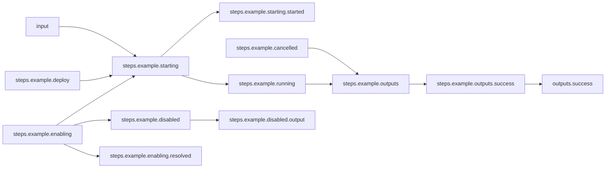

# Basic Workflow

## Workflow Description

This workflow simply runs a single step of an example plugin and reports its success output.

## Files

- [`workflow.yaml`](workflow.yaml) -- Defines the workflow input schema, the plugins to run
  and their data relationships, and the output to present to the user
- [`input.yaml`](input.yaml) -- The input parameters that the user provides for running
  the workflow
                     
## Running the Workflow

Download the Arcaflow engine from: https://github.com/arcalot/arcaflow-engine/releases
 
Run the workflow:
```bash
arcaflow --input input.yaml 
```

Example output:
```yaml
output_data:
    example:
        message: Hello, Arcalot!
output_id: success
```

## Workflow Diagram

