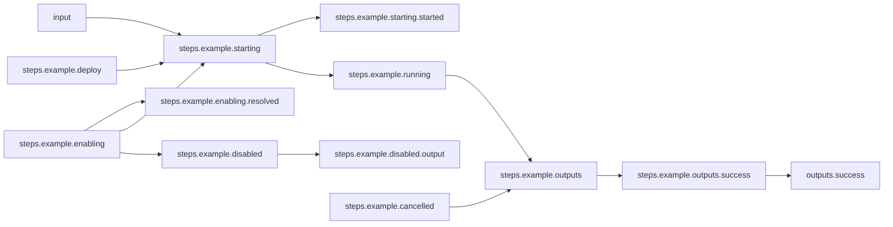

# Basic Workflow

## Workflow Description

This workflow simply runs a single step of an example plugin via the default deployer (defined in `config.yaml`) and reports its success output.

## Files

- [`workflow.yaml`](workflow.yaml) -- Defines the workflow input schema, the plugins to run
  and their data relationships, and the output to present to the user
- [`input.yaml`](input.yaml) -- The input parameters that the user provides for running
  the workflow
- [`config.yaml`](config.yaml) -- Global config parameters that are passed to the Arcaflow
  engine
                     
## Running the Workflow

### Workflow Execution

Download the Arcaflow engine from: https://github.com/arcalot/arcaflow-engine/releases
 
Run the workflow:
```
$ arcaflow --context <workflow directory> --input input.yaml --config config.yaml 
```

## Workflow Diagram

