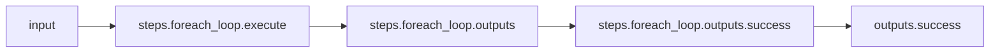
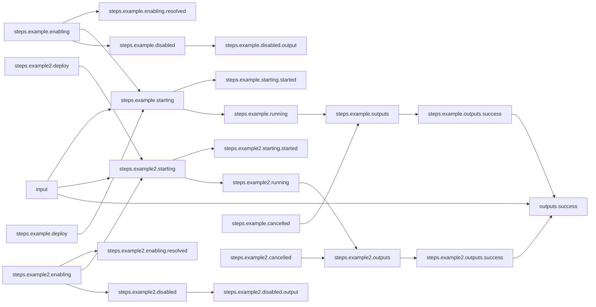

# Binding Repeated Values

## Workflow Description

### Parent workflow

This workflow demonstrates how to use the Arcaflow builtin function `bindConstants()` to
repeat a set of input values with each item in your input list using a `foreach` loop.

### Subworkflow

The subworkflow uses a plugin to print the value of the `name` input.  The `loop_id` and
`nickname` input values are bundled with this plugin output as this subworkflow's
output. The example plugin is used to simulate an operation on input data and produce an
output. In a real world scenario, the subworkflow would presumably use more complex
plugins with more complex schemas.

## Files

- [`workflow.yaml`](workflow.yaml) -- Defines the workflow input schema, the steps to
  execute, their data relationships, and the output to present to the user
- [`input.yaml`](input.yaml) -- The input parameters that the user provides for running
  the workflow
- [`subworkflow.yaml`](subworkflow.yaml) -- Defines the subworkflow input schema and the
  plugins to execute.
                     
## Running the Workflow

Download the Arcaflow engine from: https://github.com/arcalot/arcaflow-engine/releases
 
Run the workflow:
```bash
arcaflow --input input.yaml
```

Example output:
```yaml
output_data:
    fab_four:
        - hello:
            band: Hello, Beatle!
            beatle: Hello, John!
          loop_id: 1
        - hello:
            band: Hello, Beatle!
            beatle: Hello, Paul!
          loop_id: 2
        - hello:
            band: Hello, Beatle!
            beatle: Hello, George!
          loop_id: 3
        - hello:
            band: Hello, Beatle!
            beatle: Hello, Ringo!
          loop_id: 4
output_id: success
```

## Workflow Diagram 

### Parent workflow


### Sub-Workflow
