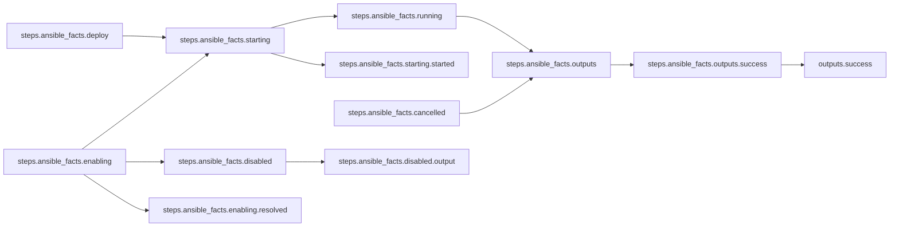

# Using Config Files

## Workflow Description

This workflow runs a simple metadata collection step that uses Ansible's gather facts
plugin, and returns only the system hostname. In order to collect the metadata in the
host context rather than the container context, the step container must be run with host
networking mode. This example enables host networking mode as a global default for the
workflow via an
[Arcaflow config file](https://arcalot.io/arcaflow/running/setup/#configuration) in the
[`config.yaml`](config.yaml) file.

> [!NOTE]
> This workflow does not require an input file.

## Files

- [`workflow.yaml`](workflow.yaml) -- Defines the workflow input schema, the plugins to
  run and their data relationships, and the output to present to the user
- [`config.yaml`](config.yaml) -- Global config parameters that are passed to the
  Arcaflow engine
                     
## Running the Workflow

### Workflow Execution

Download the Arcaflow engine from: https://github.com/arcalot/arcaflow-engine/releases

> [!TIP]
> Because this workflow takes no input and uses the default `workflow.yaml` file name,
> the only parameter we need to pass to Arcaflow is for the config file.

Run the workflow without a config file:
```bash
arcaflow 
```

The output is the transient hostname of the container, for example:
```yaml
output_data:
    hostname: 54811f760d91
output_id: success
```

Run the workflow with the config file:
```bash
arcaflow --config config.yaml
```

The output is the hostname of the container host system, for example:
```yaml
output_data:
    hostname: my.system.hostname
output_id: success
```

## Workflow Diagram

