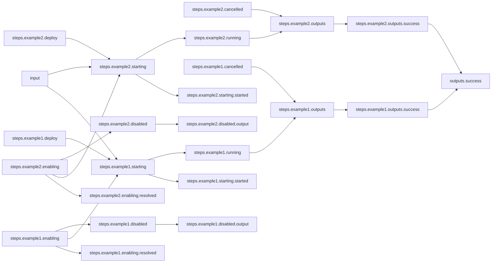

# Expressions

## Workflow Description

This workflow demonstrates some example expressions as detailed in our [expression documentation](https://arcalot.io/arcaflow/workflows/expressions/). Arcaflow expressions are a way to reference paths within the workflow or their fields, and/or manipulate the data.

Arcaflow expressions were inspired by JSONPath but have diverged from the syntax. You can use expressions in a workflow YAML like this:

```
some_value: !expr $.your.expression.here
```

## Examples

Basic path references are already used across the other example workflows. These include references in a step to an input from the schema:

```
steps:
  example:
    plugin:
      deployment_type: image
      src: quay.io/arcalot/arcaflow-plugin-example:0.5.0
    input:
      name:
        _type: nickname
        #Expression for an input path reference
        nick: !expr $.input.nickname
```

As well as references in the output to a step field:

```
outputs:
  success:
    #Expression for a step field reference
    example: !expr $.steps.example.outputs.success
```

This workflow demonstrates string literals and concatenation:

```
steps:
  example1:
    plugin:
      deployment_type: image
      src: quay.io/arcalot/arcaflow-plugin-template-python:0.4.0
    input:
      #Expression with concatenation and string literal
      name: !expr $.input.name +  ' - \"The Noble Workflow Engine\"'
```

As well as type conversions and math operations:

```
steps:
  example2:
    plugin:
      deployment_type: image
      src: quay.io/arcalot/arcaflow-plugin-template-python:0.4.0
    input:
      # Expression with type conversions, math operation, and concatenation
      name: !expr intToString(floatToInt(intToFloat($.input.int_value) * $.input.float_value)) + ' User'
```

Int this last expression, the plugin requires a string input. The logical steps here are:
1.  An integer input is converted to a float in order to make it compatible with a math operation with another float input: `intToFloat($.input_int_value)`
2. The two float values are multiplied: `... * $.input.float_value`
3. The resulting float is converted to an integer (which rounds towards the nearest integer): `floatToInt(...)`
4. The integer is converted to a string: `intToString(...)`
5. Finally, the two strings are concatenated: `... + ' User'`

## Files

- [`workflow.yaml`](workflow.yaml) -- Defines the workflow input schema, the plugins to run and their data relationships, and the output to present to the user
- [`input.yaml`](input.yaml) -- The input parameters that the user provides for running the parent workflow
- [`config.yaml`](config.yaml) -- Global config parameters that are passed to the Arcaflow engine
                     
## Running the Workflow

### Workflow Execution

Download a Go binary of the latest version of the Arcaflow engine from: https://github.com/arcalot/arcaflow-engine/releases
 
Run the workflow:
```
$ export WFPATH=<path to this workflow directory>
$ arcaflow -input ${WFPATH}/input.yaml -config ${WFPATH}/config.yaml -context ${WFPATH}
```

## Workflow Diagram


