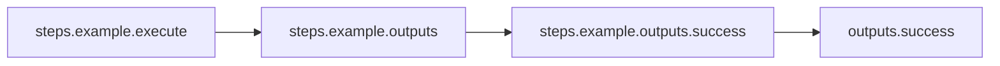
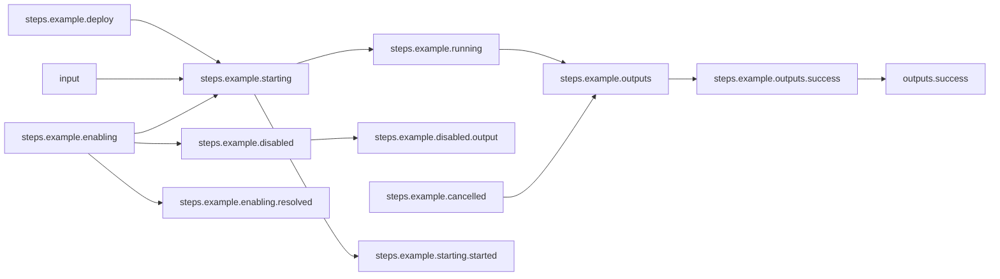

# Quoting

## Workflow Description

This workflow demonstrates example expressions with quotes as detailed in our [expression documentation](https://arcalot.io/arcaflow/workflows/expressions/).

There are multiple types of quoting supported. Quotes must pass through YAML's syntax; both the expression language and YAML itself process the quotes and escaped characters, and the input must be valid for both. Consider using YAML "Block Flow Scalar" format to prevent YAML from changing your quotes, and using Arcaflow expression "raw" strings (with back-ticks `) to not need to escape the quotes. In addition, you can use single or double quotes.

Look at this example to see about the various ways to create the same input.
  
> [!NOTE]
> This workflow does not require an input file.

## Files

- [`workflow.yaml`](workflow.yaml) -- Defines the workflow input schema, the plugins to run
  and their data relationships, and the output to present to the user. Step `example` then runs the subworkflow provided in `subworkflow.yaml` with a list of inputs. For each string in the list of foreach inputs, the subworkflow runs with the string as its input; this workflow then outputs a list of the values returned from each invocation of the subworkflow.
- [`subworkflow.yaml`](subworkflow.yaml) -- A simple workflow invocable by the main workflow which returns its input as its output.
                   

## Running the Workflow

Download the Arcaflow engine from: https://github.com/arcalot/arcaflow-engine/releases

> [!TIP]
> Because this workflow takes no input and uses the default `workflow.yaml` file name,
> we do not need to pass any parameters to the `arcaflow` command.

 
Run the workflow:
```bash
arcaflow
```

Each input expression to the `name` parameter outputs as the same string:
```yaml
output_data:
    message:
        data:
            - name: Hello, Here's an apostrophe and "embedded quotes".!
            - name: Hello, Here's an apostrophe and "embedded quotes".!
            - name: Hello, Here's an apostrophe and "embedded quotes".!
            - name: Hello, Here's an apostrophe and "embedded quotes".!
            - name: Hello, Here's an apostrophe and "embedded quotes".!
            - name: Hello, Here's an apostrophe and "embedded quotes".!
output_id: success
```

## Workflow Diagram 

### Parent workflow



### Subworkflow

