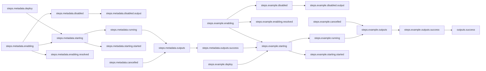

# Implicit Serial Workflow

## Workflow Description

By default, multiple steps in a workflow will be run in parallel if there is no data
dependency between the steps. When the input of a step relies on the output
of another step, an implicit serial relationshp is created.

This workflow runs a metadata collection plugin step and then an example plugin (in this
case using the template plugin) that takes its `name` input from the `fqdn` output
returned by the metadata plugin. All steps are run via the default deployer, and their
success outputs are reported.

> [!NOTE]
> This workflow does not require an input file.

## Files

- [`workflow.yaml`](workflow.yaml) -- Defines the workflow input schema, the plugins to
  run and their data relationships, and the output to present to the user
                     
## Running the Workflow

Download the Arcaflow engine from: https://github.com/arcalot/arcaflow-engine/releases

> [!TIP]
> Because this workflow takes no input and uses the default `workflow.yaml` file name,
> we do not need to pass any parameters to the `arcaflow` command.
 
Run the workflow:
```bash
arcaflow
```

Example output:
```yaml
output_data:
    example:
        message: Hello, 6db47e48105d!
output_id: success
```

## Workflow Diagram

