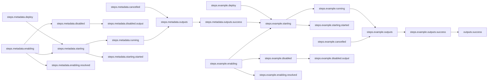

# Implicit Serial Workflow

## Workflow Description

By default, multiple steps in a workflow will be run in parallel if there is no data
passing relationship between the steps. When the input of a step relies on the output
of another step, an implicit serial relationshp is created.

This workflow runs a metadata collection plugin step and then an example plugin (in this
case using the template plugin) that takes its `name` input from the `fqdn` output
returned by the metadata plugin. All steps are run via the default deployer (defined in
`config.yaml` as podman) and their success outputs are reported.

*Note: This workflow does not require any input.*

## Files

- [`workflow.yaml`](workflow.yaml) -- Defines the workflow input schema, the plugins to
run and their data relationships, and the output to present to the user
- [`config.yaml`](config.yaml) -- Global config parameters that are passed to the
Arcaflow engine
                     
## Running the Workflow

### Workflow Execution

Download a Go binary of the latest version of the Arcaflow engine from:
https://github.com/arcalot/arcaflow-engine/releases
 
Run the workflow:
```
$ export WFPATH=<path to this workflow directory>
$ arcaflow --context ${WFPATH} --config config.yaml 
```

## Workflow Diagram

