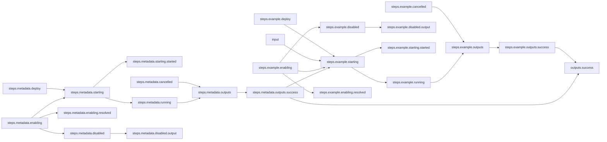

# Explicit Serial Workflow

## Workflow Description

By default, multiple steps in a workflow will be run in parallel if there is no data dependency between the steps. In some cases, you may want to run steps in a serial manner when there is no such relationship between the steps. For this case, there is the `wait_for` option, which tells a step explicitly to wait for a condition from another step.

This workflow runs a metadata collection plugin step, and then an example plugin that waits for the success of the metadata collection before starting. All steps are run via the default deployer (defined in `config.yaml`), and their success outputs are reported.

## Files

- [`workflow.yaml`](workflow.yaml) -- Defines the workflow input schema, the plugins to run
  and their data relationships, and the output to present to the user
- [`input.yaml`](input.yaml) -- The input parameters that the user provides for running
  the workflow
- [`config.yaml`](config.yaml) -- Global config parameters that are passed to the Arcaflow
  engine
                     
## Running the Workflow

### Workflow Execution

Download the Arcaflow engine from: https://github.com/arcalot/arcaflow-engine/releases
 
Run the workflow:
```
$ arcaflow --context <workflow directory> --input input.yaml --config config.yaml
```

## Workflow Diagram

