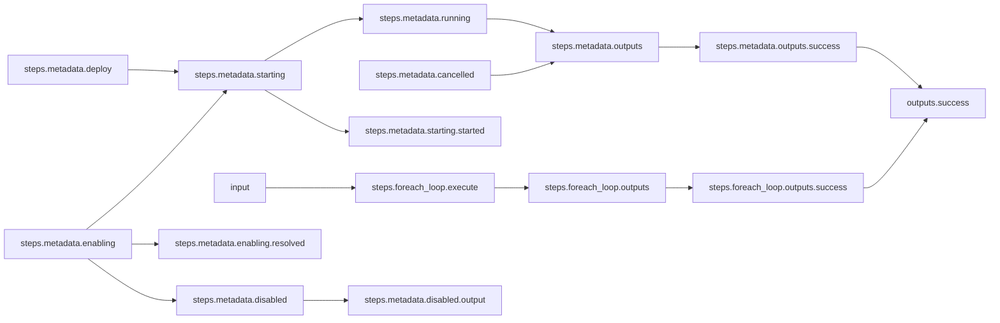
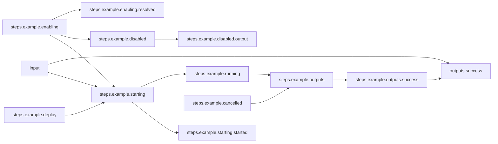

# Looping For-each Sub-Workflow

## Workflow Description

A workflow can iterate over a sub-workflow in a for-each manner by providing a list of
input objects compatible with the sub-workflow's schema and specifying `kind: foreach`
in the step parameters. The Arcaflow expression language is used to pass the compatible
input list object to the `items` parameter of the step.

This workflow runs a metadata collection plugin step in the parent workflow, and then a
loop of sub-workflows that each run an example plugin. All steps are run via the default
deployer (defined in `config.yaml`), and their success outputs are reported.

## Files

- [`workflow.yaml`](workflow.yaml) -- Defines the workflow input schema, the plugins to
  run and their data relationships, and the output to present to the user
- [`subworkflow.yaml`](subworkflow.yaml) -- Defines the subworkflow input schema and the
  plugins to execute.
- [`input.yaml`](input.yaml) -- The input parameters that the user provides for running
  the workflow
                     
## Running the Workflow

Download the Arcaflow engine from: https://github.com/arcalot/arcaflow-engine/releases
 
Run the workflow:
```bash
arcaflow --input input.yaml
```

Example output:
```yaml
output_data:
    fab_four:
        - beatle:
            message: Hello, John!
          loop_id: 1
        - beatle:
            message: Hello, Paul!
          loop_id: 2
        - beatle:
            message: Hello, George!
          loop_id: 3
        - beatle:
            message: Hello, Ringo!
          loop_id: 4
    metadata:
        architecture: aarch64
        env:
            _: /usr/bin/python
            AD_HOC_COMMAND_ID: "1"
            ANSIBLE_CACHE_PLUGIN: jsonfile
            ANSIBLE_CACHE_PLUGIN_CONNECTION: /tmp/artifacts/53c44d9d-5155-4bd1-916d-ac7d5df1e55d/fact_cache
            ANSIBLE_CALLBACK_PLUGINS: /usr/local/lib/python3.9/site-packages/ansible_runner/display_callback/callback
            ANSIBLE_HOST_KEY_CHECKING: "False"
            ANSIBLE_LOAD_CALLBACK_PLUGINS: "1"
            ANSIBLE_RETRY_FILES_ENABLED: "False"
            ANSIBLE_STDOUT_CALLBACK: awx_display
            AWX_ISOLATED_DATA_DIR: /tmp/artifacts/53c44d9d-5155-4bd1-916d-ac7d5df1e55d
            HOME: /root
            HOSTNAME: 36dd1555d171
            LC_CTYPE: C.UTF-8
            PATH: /usr/local/sbin:/usr/local/bin:/usr/sbin:/usr/bin:/sbin:/bin
            PWD: /tmp
            RUNNER_OMIT_EVENTS: "False"
            RUNNER_ONLY_FAILED_EVENTS: "False"
            SHLVL: "2"
            container: podman
        fqdn: 36dd1555d171
        kernel: 6.8.10-400.asahi.fc40.aarch64+16k
        memtotal_mb: 31621
        processor:
            - "0"
            - "1"
            - "2"
            - "3"
            - "4"
            - "5"
            - "6"
            - "7"
            - "8"
            - "9"
            - "10"
            - "11"
        processor_cores: 1
        processor_count: 12
        processor_threads_per_core: 1
        product_name: NA
        product_version: NA
        swaptotal_mb: 8191
        system_vendor: NA
        uptime_seconds: 610461
output_id: success
```

## Workflow Diagram

### Parent workflow



### Sub-Workflow


